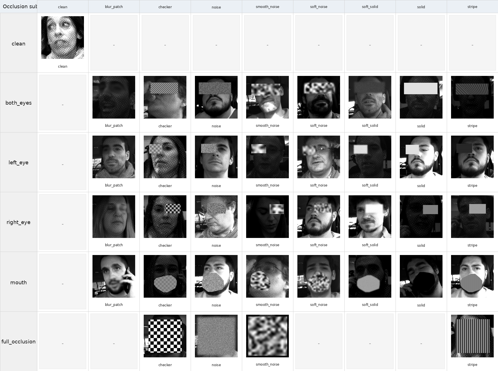

# Occlusion Masking Subset (차폐 합성 마스킹 서브셋)

OcclusionGateNet의 **차폐 강건성**을 위해 DMD 얼굴 영상에 **부위별 synthetic occlusion**을 합성하는
데이터·코드 툴체인. 원본 DMD만으로는 부위별 차폐를 통제해 학습·평가하기 어렵기 때문에, 눈·입 등 주요
얼굴 영역을 다양한 appearance로 인위 차폐한 서브셋을 자체 구축했다.

이 마스킹은 **ORFormer+HGNet 랜드마크 복원 모델의 fixedmask fine-tuning**에 사용된다.
기존 HGNet(phase3a)은 zero-paint(검정) 6종만 학습해 checker/stripe/noise 등 다양한 appearance에서
가린 부위의 복원 오차(NME)가 커졌는데, 여기서 만든 **8종 appearance 합성 차폐**로 추가 학습해
clean 대비 NME ≤ 5%로 복원하도록 강건화했다. (이 강건화된 HGNet을 `full_system`의 `HGNetRestorer`가 사용.)

> ⚠️ 부위별 **가시성 판단 CNN(Occlusion CNN)** 은 이 데이터가 아니라 **별도의 hand-labeled 데이터**로
> 학습된 모델(hyi Step9)이다. 본 폴더는 **랜드마크 복원(HGNet) 파인튜닝**용 합성 차폐 툴체인이다.



*행 = 차폐 region(clean / both_eyes / left_eye / right_eye / mouth / full_occlusion),
열 = appearance(blur_patch / checker / noise / smooth_noise / soft_noise / soft_solid / solid / stripe).*

## 구성 요소

| 파일 | 역할 |
|---|---|
| `make_region_occlusion_dataset.py` | **부위별 합성 차폐 생성기** — DMD FaceMesh로 얼굴 crop 후 region polygon에 8종 appearance 패턴(`make_pattern`)을 합성. `pipeline/finetune_hgnet_fixedmask.py`가 이 `make_pattern`을 import해 **HGNet 파인튜닝 중 입력에 on-the-fly 차폐**를 렌더링한다. (standalone 실행 시 crop 데이터셋 + `labels.jsonl`도 생성.) |
| `make_masked_videos.py` | **마스킹 비디오 생성** — sunglasses(both/left/right)·lower/left/right-face-half 등 fixedmask 변형 영상 합성(`facemesh_masked_videos_v3`). clean/masked 짝 데이터셋으로 차폐-강건 분류기 학습·평가 및 복원 좌표 재생성에 사용. |
| `make_occlusion_sample_grid.py` | region×appearance 샘플 그리드 시각화 생성기(위 그림). |
| `face_regions.py` | mediapipe 478 landmark의 **10-region anatomical** 인덱스(LEFT_EYE/RIGHT_EYE/BROW/NOSE/MOUTH/FACE_OVAL/CHEEK_JAW…). |
| `face_regions7.py` | 위 10-region을 gaze 친화적 **7-region**(left_eye/right_eye/nose/mouth/contour/upper_face/lower_face)으로 재조합. 마스크를 씌울 region landmark 인덱스로 사용. |

## HGNet fixedmask fine-tuning에서의 사용 흐름

```
clean 얼굴 crop + clean mediapipe 좌표(GT)
   └─ region(le/re/mouth/both_eyes) 선택 → face_regions7 인덱스로 convex hull
      └─ make_region_occlusion_dataset.make_pattern(8 appearance 중 1) 로 해당 영역 덮음
         └─ (masked crop) → ORFormer(frozen) + HGNet(학습) → 복원 좌표
            └─ loss = NME(복원 좌표, clean GT)  → 가린 부위도 정확히 복원하도록 학습
```

8 appearance: `solid · soft_solid · blur_patch · smooth_noise · soft_noise · noise · checker · stripe`.

## 라벨 형식 (`labels.jsonl`, standalone 데이터셋)

각 이미지 1줄 JSON — 어느 **부위(region)** 를 어떤 **appearance** 로 가렸는지 메타 + crop 정보:

```json
{"image_path": "...left_eye_solid_facecrop256.jpg", "region": "left_eye", "appearance": "solid",
 "labels": {"left_eye": 1, "right_eye": 0, "mouth": 0}, "label_vector": [1,0,0],
 "src_npz": "...facemesh.npz", "frame_idx": 273,
 "crop_info": {"face_crop_xyxy": [...], "num_valid_landmarks": 478}}
```

- `region`/`appearance` = 마스킹된 부위·패턴, `labels` = 가려진 부위 표시(occluded=1)
- `src_npz` = 원본 clean FaceMesh 좌표(복원 GT의 출처)
- `samples/labels_sample.jsonl` 에 예시 40줄 포함.

## 샘플 (`samples/`)

레포에는 **소량 예시**만 포함(전체는 용량 문제로 미포함).
- `occlusion_region_appearance_grid.png` (+ `.csv`) — 위 그리드
- `images/` — region×appearance 대표 crop 12장
- `labels_sample.jsonl` — 라벨 40줄

전체 데이터(on-box):
`/data/shared/Occlusion_subset_dataset/region_occlusion_cnn_dataset_v2_facecrop_256/`,
마스킹 비디오: `/data/shared/DMD_landmarks/facemesh_masked_videos_v3/`.
HGNet 파인튜닝 코드: [`../../pipeline/finetune_hgnet_fixedmask.py`](../../pipeline/finetune_hgnet_fixedmask.py).

## 실행 (on-box)

스크립트 상단 경로 상수(`SRC_ROOT`, `VIDEO_ROOT`, `OUT_ROOT`)를 환경에 맞게 지정 후 실행:

```bash
python make_region_occlusion_dataset.py   # 합성 차폐 crop 데이터셋(+labels)
python make_masked_videos.py              # fixedmask 변형 영상
python make_occlusion_sample_grid.py      # 샘플 그리드
```

> 원본 코드 출처: `external_scripts/hyi_masking/`(마스킹 생성, hyi) · `Gaze_image_model/src/data/face_regions7.py`(yg).
> HGNet 복원 모델·OcclusionGateNet 연계는 저장소 루트 `README.md`·`models/MODELS.md` 참조.
</content>
